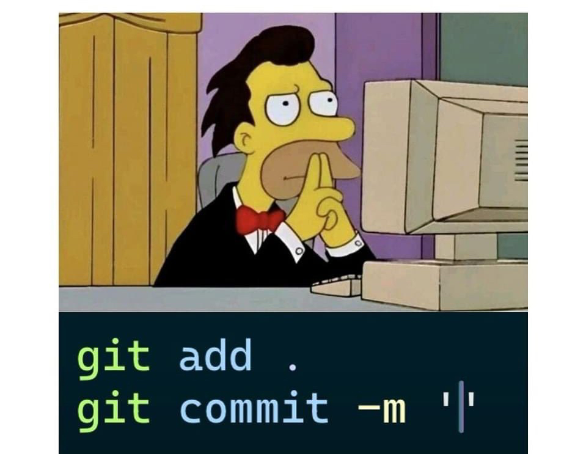

# 🧠 DiffScribe: AI-Powered Commit Messages

We've all been there. Staring at the screen, fingers hovering over the keyboard, trying to come up with the perfect commit message. Minutes tick by, and the pressure mounts. Sound familiar? 

Say goodbye to commit message writer's block! 👋

DiffScribe is here to rescue you from the commit message abyss. This intelligent VS Code extension analyzes your changes and crafts meaningful, descriptive commit messages in seconds. Powered by your choice of Claude AI or Groq, DiffScribe brings expert-level Git practices to every developer, saving you time and mental energy.

## ✨ Key Features

- 🚀 **Instant Generation**: Create informative commit messages with a single command
- 🤖 **Dual AI Power**: Choose between Claude AI (Anthropic) or Groq for message generation
- ⏳ **Time-Saving**: Streamlines the commit process, especially for complex changes
- 📊 **Consistency**: Maintains a clean, professional Git history
- 📋 **Clipboard Integration**: Automatically copies generated messages for quick use
- 🕰️ **Flexible Time Ranges**: Generate messages for custom time periods or since last push
- 💾 **Commit Integration**: Option to commit changes directly with the generated message

## 🎯 Perfect for:

- 🌱 Beginners learning Git best practices
- 👨‍💻 Seasoned pros streamlining their workflow
- 👥 Teams aiming for consistent, meaningful commit histories

## 🚀 Getting Started

1. Install the DiffScribe extension in VS Code
2. Set up your Anthropic (Claude AI) or Groq API key
3. Choose your preferred AI provider in the settings
4. Start generating awesome commit messages!

## 💡 Usage

- Use the command palette to generate messages for staged changes
- Select custom time ranges to capture all your recent work
- Choose to commit directly or copy the message to clipboard
- Quickly edit generated messages if needed before committing

## 🔑 API Key Setup

DiffScribe requires an API key for either Anthropic (Claude AI) or Groq. Set these as environment variables or in the extension settings.

## 🎉 Upgrade Your Commits Today!

Stop wasting time crafting the perfect commit message. Let DiffScribe be your AI pair programmer, turning your code changes into clear, concise, and meaningful commit messages in seconds. 

Say hello to a more efficient, descriptive version control process. Let DiffScribe handle the commit messages while you focus on what really matters – writing great code!

Happy coding! 🚀✨